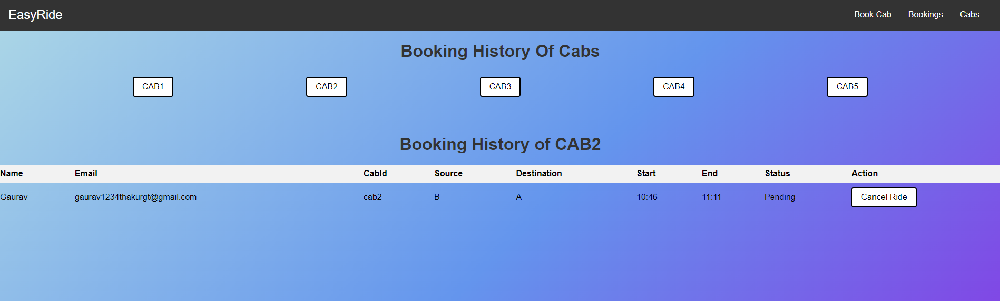
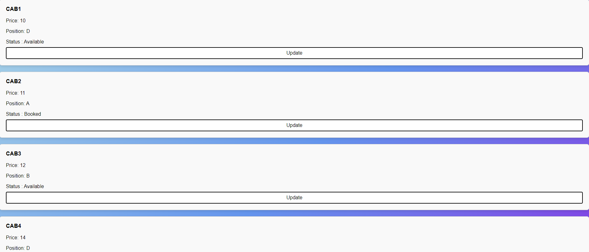
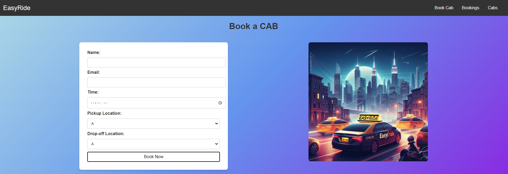
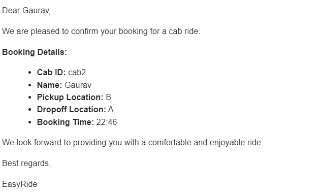
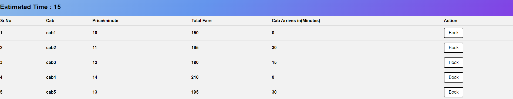

# EasyRide

## **1. Description:**
Create a web application for a cab system where users can enter the source and destination and they will be provided with the shortest time and estimated cost.

## **2. Requirements:**
- The system should be able to manage cab booking.
- The below provided is the time taken between different destinations. For example, from A to B the time taken is 5 min, similarly from D to F the time taken is 20 min.
-   

- The user should be able to book a cab by providing the user's email, source, and destination.
- The system should be able to calculate the shortest possible time from source to destination. For example, There are multiple ways from A to D, but the shortest route will be via C.
- There are a total of 5 cabs with different pricing. (Price/minute). No cab should have overlapping start and end times.
- The system should provide the estimated cost depending on the cab chosen and the time taken to reach the destination.
- The system should be able to track the cab booking.
- Users should be able to view and edit the cabs and their pricing.

## **3. Note:**
- No need to develop login/signup pages, just make an assumption that only admins will be accessing it and just try to cover the basic requirements part with this assumption.
- Create your app’s frontend as a SPA (Single Page Application).
- Create a proper ReadME file describing the functioning of your project.

## **4. Working:** 
- The website name is EasyRide.
- Upon opening the website, the user is greeted with a navbar having 3 pages: "Book a Cab", "Bookings", and "Cabs".
- In the "Book a Cab" page, the user is provided with a form to enter name, email, time, source location, and destination location. After submission, the shortest time is calculated using Dijkstra's algorithm and displayed along with the different cab's pricing and arrival time. The user can then book any available cab.
- The "Bookings" page allows users to view all the bookings for different cabs. Users can also cancel a ride if it is not already completed.
- The "Cabs" page displays cab details such as CabId, current position, and price. Users can also edit these details. Additionally, users can see if the cab is already booked or not.

## **5. Functionality:**
- Upon opening the website, users can navigate through the navbar to access different pages.
- In the "Book a Cab" page, users can fill out a form with their details and select the source and destination locations. After submission, the shortest time and estimated cost are displayed along with available cabs. Users can book any available cab.
- The "Bookings" page allows users to view all bookings and cancel rides if they are not completed.
- The "Cabs" page displays cab details and allows users to edit them as needed.

## **Snapshots of project:**
 

